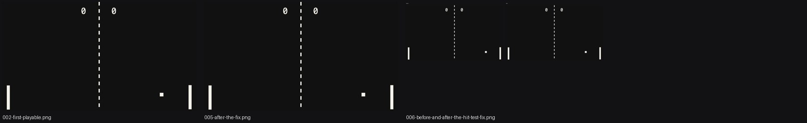

# devlog-recorder

**Record your AI-agent build session as a video-ready devlog.** Every prompt, every output, screenshots, produced assets and short clips of anything that moves, in order, with your words kept verbatim. When the thing is built, you have the whole story on one contact sheet and a beat-by-beat brief ready for a script.

Works with any agent that can run shell commands: Claude Code, Codex, Cursor, Gemini CLI, a human with a terminal. Ships as a **Claude Code skill** (`SKILL.md`): drop the folder in `~/.claude/skills/` and the agent logs and captures as it works.

<p align="center"><br><sub>One session, one sheet: the example below built a Pong game in five turns.</sub></p>

## Why

The devlog video is the most watched format in indie game dev, and the material for it is exactly what gets lost while you're building: the first ugly attempt, what you said when it broke, the fix, the numbers. This tool makes the agent keep that material as a side effect of working, so the video (or the write-up, or the talk) is a script away.

## Install

```bash
git clone https://github.com/isabellagreco1997/devlog-recorder
cd devlog-recorder
pip install -e .        # Pillow only
npm install             # puppeteer-core, uses the Chrome you already have
brew install ffmpeg     # or apt / choco
```

## Use

```bash
devlog init pong                                   # devlog/pong/, active in this folder
devlog note --user "make me a pong game in one html file" --agent "Wrote index.html: canvas, two paddles, AI on both sides"
devlog shot index.html --caption "first playable"
devlog clip index.html --dur 6 --caption "auto-play rally"          # live capture in headless Chrome
devlog clip game.html --dur 6 --keys "ArrowRight:0-2500,Space:800-900"   # with input
devlog add sprite.png --caption "the extracted sprite"
devlog compare v1.png v2.png --caption "tube legs vs real legs"
devlog screen --caption "the editor"                                # desktop grab
devlog sheet                                       # sheets/contact.jpg
devlog brief                                       # brief.md: turning points, beats, script skeleton
```

What you get, in `devlog/<name>/`:

```
log.md          readable, chronological, one section per entry, images inline
timeline.json   the same as data
assets/         001-first-playable.png, 002-the-extracted-sprite.png, ...
clips/          003-auto-play-rally.mp4, ...
sheets/         contact.jpg
brief.md        turning points (fail / fix / win), every beat with its quote and its picture, a script skeleton
```

## The rules the agent follows

Written in full in [`SKILL.md`](SKILL.md). The short version:

1. One note per turn that changed the work. The user's words verbatim, what happened in plain words, tags: `fail`, `bug`, `fix`, `rule`, `win`, `milestone`, `decision`, `aside`.
2. Capture the evidence at the moment it exists; the next turn overwrites it.
3. Anything that moves gets a 4 to 8 second clip. Every visual fix gets a before/after.
4. Log the misses. The fails are the video.
5. No secrets, no machine paths, no other people's data. Never renumber the past.
6. At milestones: `sheet` and `brief`.

## From devlog to video

`brief.md` is a shot plan: each beat is a shot, its `show:` line is the picture, the quotes are the narration's raw material. [script-to-video](https://github.com/isabellagreco1997/script-to-video) turns a script plus those assets into the finished video.

## Example

[`examples/pong/`](examples/pong) is a complete session: a one-file Pong game and the devlog the agent kept while making it, produced by `examples/pong/run_example.sh`. Open `devlog/pong/log.md` and `brief.md` there to see the output.

## License

MIT.
