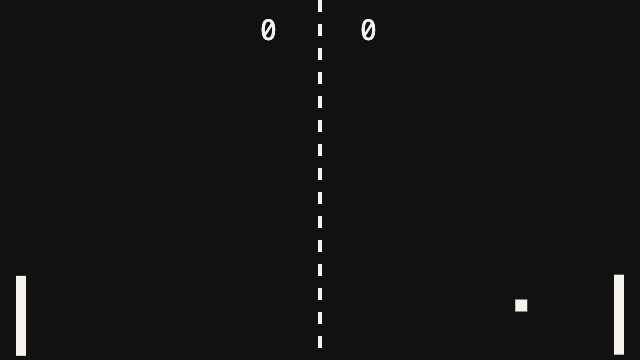
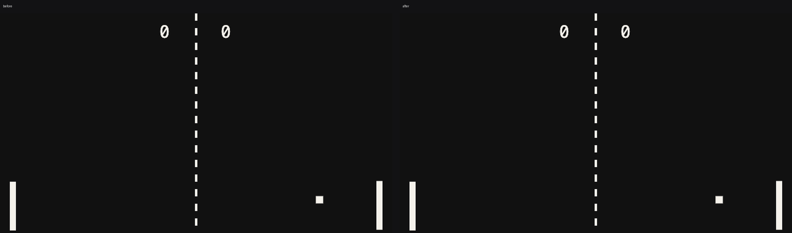

# pong devlog

Started 2026-09-03 19:26.

## 001 · 19:26 · note

**User said:** make me a pong game in a single html file, nothing fancy

**What happened:** Wrote index.html: a 640x360 canvas, two paddles, a ball, both paddles driven by a lazy AI so it plays itself. 40 lines.

_tags: milestone_

## 002 · 19:26 · shot

first playable

## 003 · 19:26 · clip

it plays itself

- `clips/003-it-plays-itself.mp4`

_tags: win_

## 004 · 19:26 · note

**User said:** the ball goes through the paddle sometimes

**What happened:** Reproduced it: the hit test only checked the ball centre, so at speed the ball skipped the 10 px paddle in one frame. Fixed by widening the test to the paddle's full height and bouncing on the paddle's face.

_tags: fail, fix_

## 005 · 19:26 · shot

after the fix

## 006 · 19:26 · compare

before and after the hit test fix

## 007 · 19:26 · note

**User said:** can i control the left one with the arrows?

**What happened:** Yes: ArrowUp/ArrowDown move the left paddle, the AI takes over when no key is held.

_tags: decision_

## 008 · 19:26 · clip

left paddle on the arrow keys

- `clips/008-left-paddle-on-the-arrow-keys.mp4`

## 009 · 19:26 · note

**User said:** ok that's enough for today

**What happened:** Stopped here. Sheet and brief written.

_tags: milestone_
