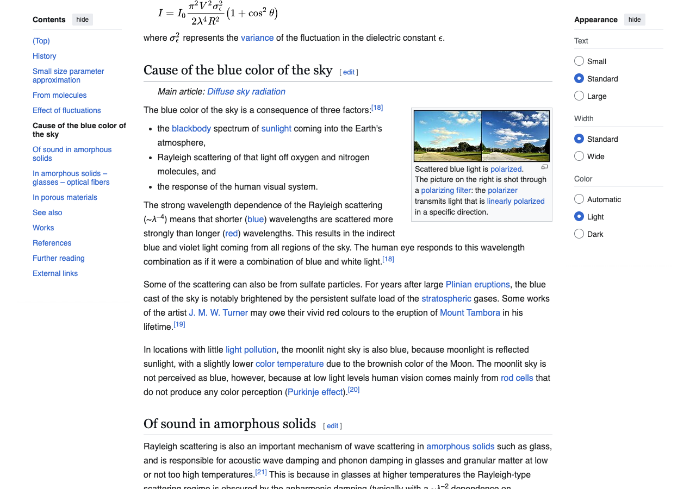
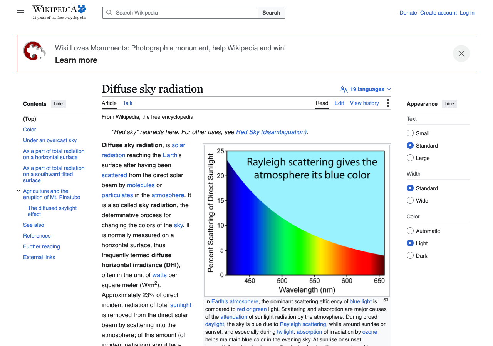
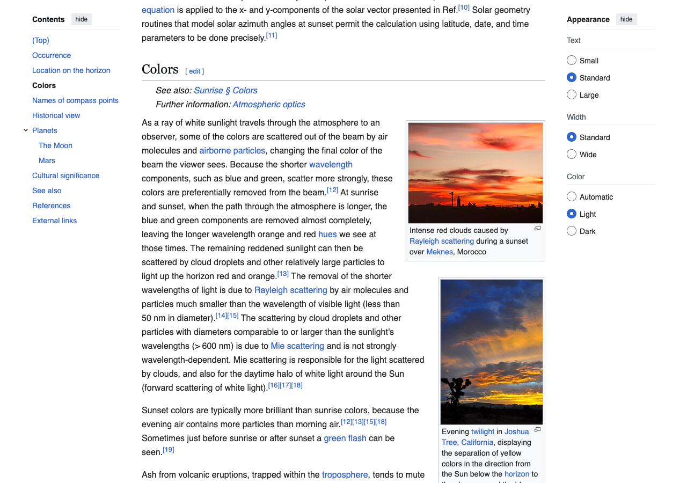

# why-is-the-sky-blue devlog

Started 2026-09-03 19:26.

## 001 · 19:26 · note

**User said:** why is the sky blue, and why is the sunset red then? i want the real answer not the kids one

**What happened:** Two candidate explanations to check: Rayleigh scattering (blue light scatters more) and ozone absorption. Reading the primary pages first.

_tags: milestone_

## 002 · 19:26 · source

Rayleigh scattering, the mechanism

Source: <https://en.wikipedia.org/wiki/Rayleigh_scattering>

> The strong wavelength dependence of the scattering means that shorter (blue) wavelengths are scattered more strongly than longer (red) wavelengths

## 003 · 19:26 · source

why the sky is not violet

Source: <https://en.wikipedia.org/wiki/Diffuse_sky_radiation>

> the scattering of sunlight in the atmosphere is strongly wavelength dependent

## 004 · 19:26 · note

**User said:** wait so why isnt it violet then, violet is shorter

**What happened:** Three reasons, from the diffuse sky radiation page: the sun emits less violet than blue, the upper atmosphere absorbs some violet, and our eyes are far less sensitive to violet. The sum reads as blue.

_tags: surprise_

## 005 · 19:26 · source

sunset: the same effect over a longer path

Source: <https://en.wikipedia.org/wiki/Sunset>

> the red hues are produced by the scattering of shorter wavelengths out of the line of sight

## 006 · 19:26 · note

**User said:** ok so sunsets are red because the blue already got scattered away before it reaches me

**What happened:** Yes. At sunset light crosses roughly 40 times more atmosphere than at noon, so most blue is scattered out of the direct beam before it arrives; what is left is orange and red. Ozone adds a little to the blue at twilight but is not the main cause.

_tags: decision_

## 007 · 19:26 · note

**User said:** good, thats the video

**What happened:** Stopped. Sheet and brief written.

_tags: milestone_
